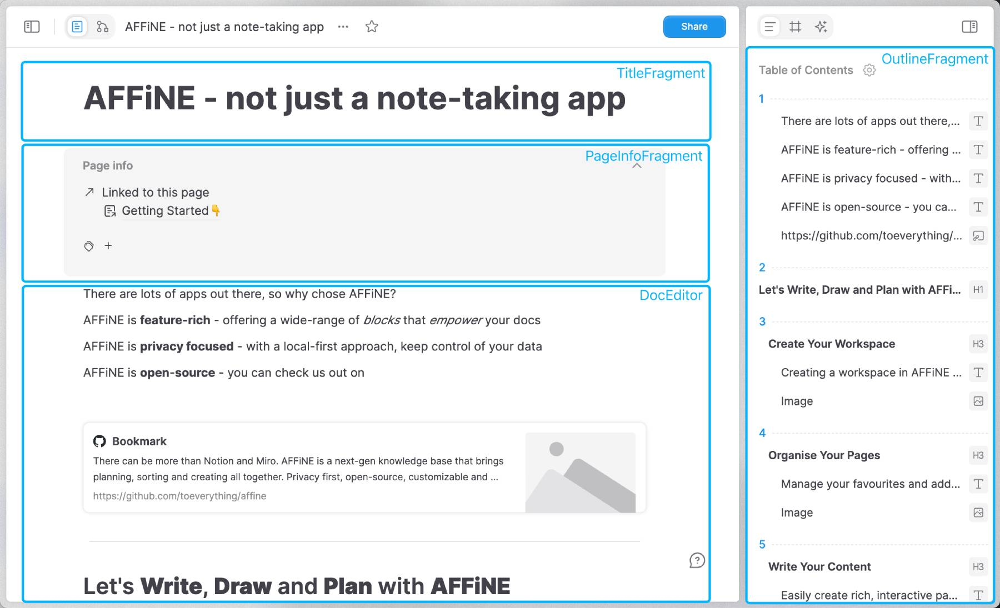
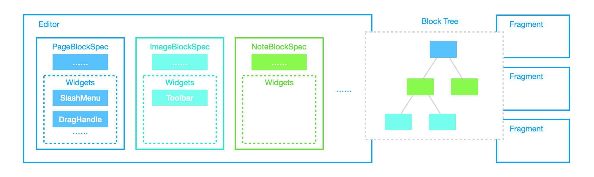
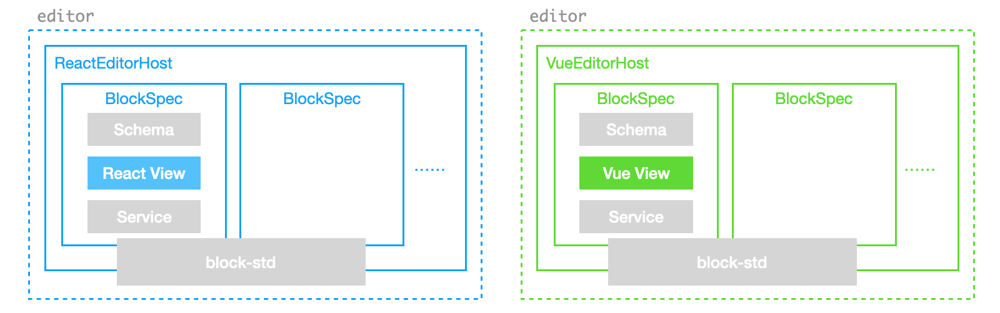
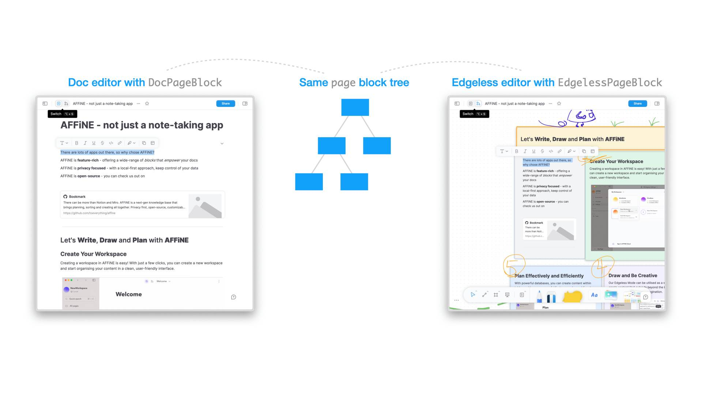

# BlockExpanse Component Types

::: info
🌐 This documentation has a [Chinese translation](https://insider.affine.pro/share/af3478a2-9c9c-4d16-864d-bffa1eb10eb6/94-Y53OqW0NFm6l-wqDz6).
:::

After getting started, this section outlines the foundational [editing components](../components/overview) in BlockExpanse, namely `Editor`, `Fragment`, `Block` and `Widget`.

## Editors and Fragments

The `@blockexpanse/presets` package includes reusable editors like `PageEditor` and `EdgelessEditor`. Besides these editors, BlockExpanse also defines **_fragments_** - UI components that are **NOT** editors but are dependent on the document's state. These fragments, such as sidebars, panels, and toolbars, may be independent in lifecycle from the editors, yet should work out-of-the-box when attached to the block tree.

The distinction between editors and fragments lies in their complexity and functionality. **Fragments typically offer more simplified capabilities, serving specific UI purposes, whereas editors provide comprehensive editing capabilities over the block tree**. Nevertheless, both editors and fragments shares similar [data flows](/blog/crdt-native-data-flow).



## Blocks and Widgets

To address the complexity and diversity of editing needs, BlockExpanse architects its editors as assemblies of multiple editable blocks, termed [`BlockSpec`](./block-spec)s. Each block spec encapsulates the data schema, view, service, and logic required to compose the editor. These block specs collectively define the editable components within the editor's environment.

Within each block spec, there can be [`Widget`](./block-widgets)s specific to that block's implementation, enhancing interactivity within the editor. BlockExpanse leverages this widget mechanism to register dynamic UI components such as drag handles and slash menus within the page editor.



## Composing Editors by Blocks

In BlockExpanse, the `editor` is typically designed to be remarkably lightweight. The actual editable blocks are registered to the [`EditorHost`](/api/@blockexpanse/block-std/) component, which is a container for mounting block UI components.

BlockExpanse by default offers a host based on the [lit](https://lit.dev) framework. For example, this is a conceptually usable BlockExpanse editor composed of [`BlockSpec`](./block-spec)s:

```ts
// Default BlockExpanse editable blocks
import { PageEditorBlockSpecs } from '@blockexpanse/blocks';
// The container for mounting block UI components
import { EditorHost } from '@blockexpanse/lit';
// The store for working with block tree
import { type Doc } from '@blockexpanse/store';

// Standard lit framework primitives
import { html, LitElement } from 'lit';
import { customElement, property } from 'lit/decorators.js';

@customElement('simple-page-editor')
export class SimplePageEditor extends LitElement {
  @property({ attribute: false })
  doc!: Doc;

  override render() {
    return html`
      <editor-host
        .doc=${this.doc}
        .specs=${PageEditorBlockSpecs}
      ></editor-host>
    `;
  }
}
```

In other words, you can think of the BlockExpanse editor as being composed in this way:

```ts
type Editor = BlockSpec[];
```

With very little overhead.

So, as long as there is a corresponding `host` implementation, you can use the component model of frameworks like react or vue to implement your BlockExpanse editors:



Explore the [`PageEditor` source code](https://github.com/Alan-Cusack/blockexpanse/blob/master/packages/presets/src/editors/page-editor.ts) to see how this pattern allows composing minimal real-world editors.

## One Block, Multiple Specs

BlockExpanse encourages the derivation of various block spec implementations from a single block model to enrich the editing experience. For instance, the root node of the block tree, the _root block_, is implemented differently for `PageEditor` and `EdgelessEditor` through two different specs **but with the same shared `RootBlockModel`**. The two block specs serve as the top-level UI components for their respective editors:



This allows you to **implement various editors easily on top of the same document**, providing diverse editing experiences and great potentials in customizability.

## Summary

So far, we have explored the interplay between different BlockExpanse component types. The subsequent sections will delve deeper into the detailed framework functionalities, beginning with block tree manipulation. For the moment, understanding the structured outline of the [BlockExpanse components](../components/overview) gallery might provide clearer insights.
